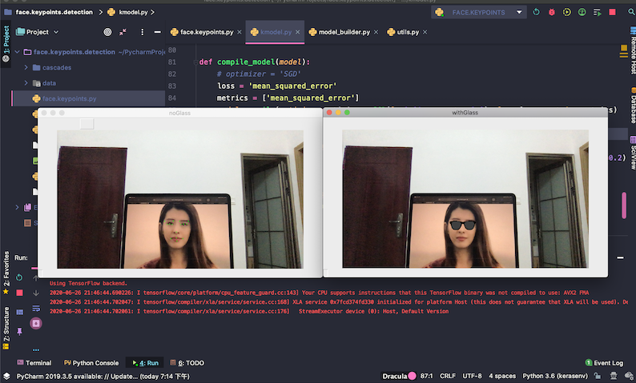

# face-keypoints-detection
Detection 15 key points on faces and mask a specific area with a token. Model based on `OpenCV` and `Keras`.

## How to play with
To have a quick glance on how this project works, simply run `face.keypoints` by loading the pre_trained model `demo_pretrained_model.h5`. The camera on your laptop will be activated and start to detect faces. A pair of sunglasses will add to the detected face.
  
The detection performance looks like below:  
  
  

## Train your on model
The model structre in `kmodel` follows a classical convolutional layers + FC layers here, you can try and make changes to get better performace. (First get your training data, which can be found on kaggle.)